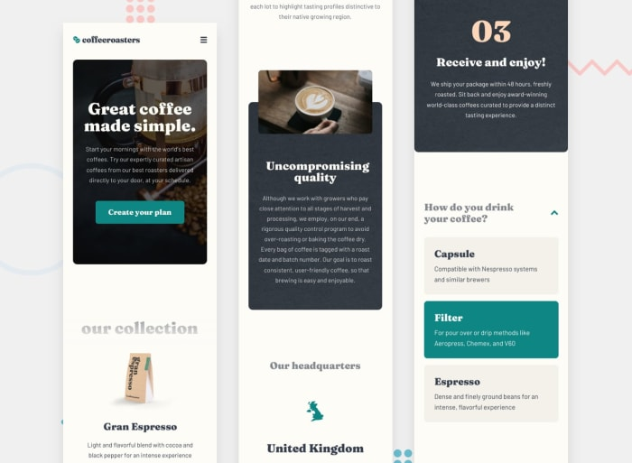
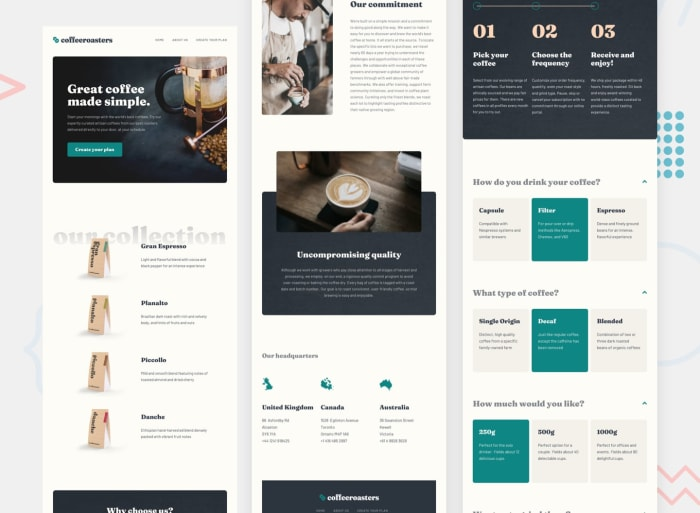

# Frontend Mentor - Coffeeroasters subscription

### Links
- Solution URL: [Coffeeroasters subscription app](https://github.com/sukanyagurav/coffeeroasters-subscription-site)
- Live Site URL: [Coffeeroasters subscription app](https://cofferoasters-subscription-site-fm.netlify.app/)

Users should be able to:

- View the optimal layout for each page depending on their device's screen size
- See hover states for all interactive elements throughout the site
- Make selections to create a coffee subscription and see an order summary modal of their choices

## Built With 
- FlexBox 
- React
- CSS3
- AOS animation

## Available Scripts

In the project directory, you can run:

### `npm start`

Runs the app in the development mode.\
Open [http://localhost:3000](http://localhost:3000) to view it in your browser.

The page will reload when you make changes.\
You may also see any lint errors in the console.

### `npm run build`

Builds the app for production to the `build` folder.\
It correctly bundles React in production mode and optimizes the build for the best performance.

The build is minified and the filenames include the hashes.\
Your app is ready to be deployed!

### Mobile View

### Tablet View

### checkout 
